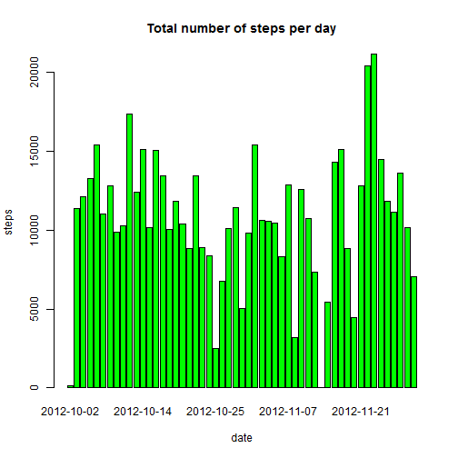
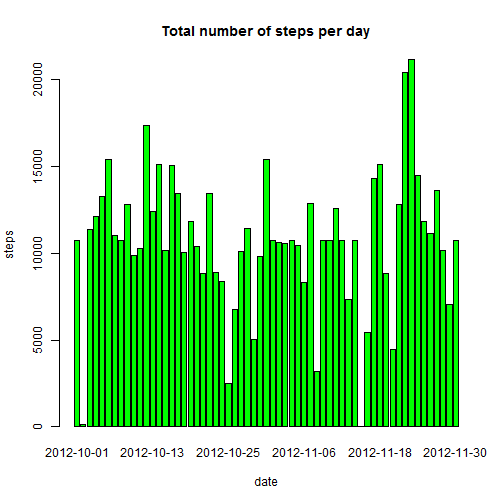
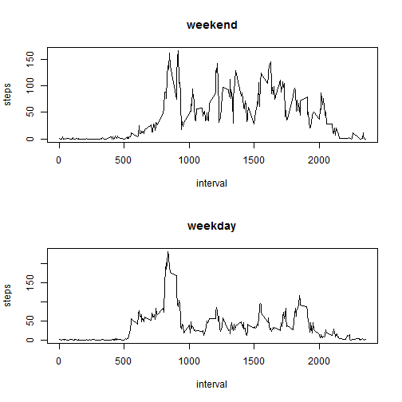

PEER ASSIGNMENT ONE
========================================================

This is an R Markdown document. Markdown is a simple formatting syntax for authoring web pages

## Loading and preprocessing the data
Loading data...


```r
unzip("activity.zip")
library(data.table)
activity <- data.table(read.csv("./activity.csv", nrows = 17568))
activityComplCases <- activity[complete.cases(activity),]
write.table(activityComplCases, "activityCompCases.txt", sep = "\t", )
```

## What is mean total number of steps taken per day?

Make a histogram of the total number of steps taken each day
Plot Histogram...


```r
stepsPerDay <- aggregate(steps ~ date, data = activityComplCases, FUN = sum)
barplot(stepsPerDay$steps, names.arg = stepsPerDay$date, xlab = "date", ylab = "steps", col = "green", main= "Total number of steps per day")
```

 


Calculate and report the mean and median total number of steps taken per day


```r
mean(stepsPerDay$steps)
```

```
## [1] 10766.19
```

```r
median(stepsPerDay$steps)
```

```
## [1] 10765
```


## What is the average daily activity pattern?

Make a time series plot (i.e. type = "l") of the 5-minute interval (x-axis) and the average number of steps taken, averaged across all days (y-axis)


```r
stepsPerInterval <- aggregate(steps ~ interval, data = activityComplCases, FUN = mean)
plot(stepsPerInterval, type = "l")
```

 

Which 5-minute interval, on average across all the days in the dataset, contains the maximum number of steps?


```r
stepsPerInterval$interval[which.max(stepsPerInterval$steps)]
```

```
## [1] 835
```

## Imputing missing values

Calculate and report the total number of missing values in the dataset (i.e. the total number of rows with NAs)


```r
head(activity)
```

```
##    steps       date interval
## 1:    NA 2012-10-01        0
## 2:    NA 2012-10-01        5
## 3:    NA 2012-10-01       10
## 4:    NA 2012-10-01       15
## 5:    NA 2012-10-01       20
## 6:    NA 2012-10-01       25
```

```r
sum(is.na(activity))
```

```
## [1] 2304
```

Devise a strategy for filling in all of the missing values in the dataset. The strategy does not need to be sophisticated. For example, you could use the mean/median for that day, or the mean for that 5-minute interval, etc.

Create a new dataset that is equal to the original dataset but with the missing data filled in.


```r
activity <- merge(activity, stepsPerInterval, by = "interval", suffixes = c("", 
    ".y"))
nas <- is.na(activity$steps)
activity$steps[nas] <- activity$steps.y[nas]
head(activity)
```

```
##    interval     steps       date  steps.y
## 1:        0  1.716981 2012-10-01 1.716981
## 2:        0  0.000000 2012-10-02 1.716981
## 3:        0  0.000000 2012-10-03 1.716981
## 4:        0 47.000000 2012-10-04 1.716981
## 5:        0  0.000000 2012-10-05 1.716981
## 6:        0  0.000000 2012-10-06 1.716981
```

```r
activityNew<- activity[, c(-4)]
head(activity)
```

```
##    interval     steps       date  steps.y
## 1:        0  1.716981 2012-10-01 1.716981
## 2:        0  0.000000 2012-10-02 1.716981
## 3:        0  0.000000 2012-10-03 1.716981
## 4:        0 47.000000 2012-10-04 1.716981
## 5:        0  0.000000 2012-10-05 1.716981
## 6:        0  0.000000 2012-10-06 1.716981
```

Make a histogram of the total number of steps taken each day and Calculate and report the mean and median total number of steps taken per day. Do these values differ from the estimates from the first part of the assignment? What is the impact of imputing missing data on the estimates of the total daily number of steps?


```r
stepsPerDate <- aggregate(steps ~ date, data = activity, FUN = sum)
barplot(stepsPerDate$steps, names.arg = stepsPerDate$date, xlab = "date", ylab = "steps", col = "green", main= "Total number of steps per day")
```

 

```r
mean(stepsPerDate$steps)
```

```
## [1] 10766.19
```

```r
median(stepsPerDate$steps)
```

```
## [1] 10766.19
```
The impact of imputing missing data on the estimates of the total daily number of steps is not much.

## Are there differences in activity patterns between weekdays and weekends?

Create a new factor variable in the dataset with two levels - "weekday" and "weekend" indicating whether a given date is a weekday or weekend day


```r
daytype <- function(date) {
    if (weekdays(as.Date(date)) %in% c("Saturday", "Sunday")) {
        "weekend"
    } else {
        "weekday"
    }
}
activity$daytype <- as.factor(sapply(activity$date, daytype))
```

Make a panel plot containing a time series plot (i.e. type = "l") of the 5-minute interval (x-axis) and the average number of steps taken, averaged across all weekday days or weekend days (y-axis). The plot should look something like the following, which was creating using simulated data:


```r
par(mfrow = c(2, 1))
for (type in c("weekend", "weekday")) {
    stepsPerType <- aggregate(steps ~ interval, data = activity, subset = activity$daytype == 
        type, FUN = mean)
    plot(stepsPerType, type = "l", main = type)
}
```

 
